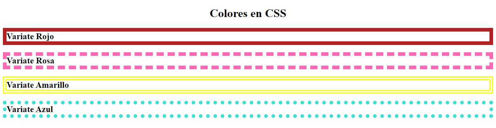
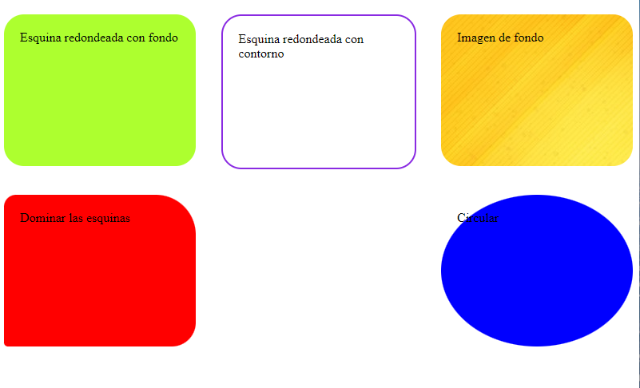
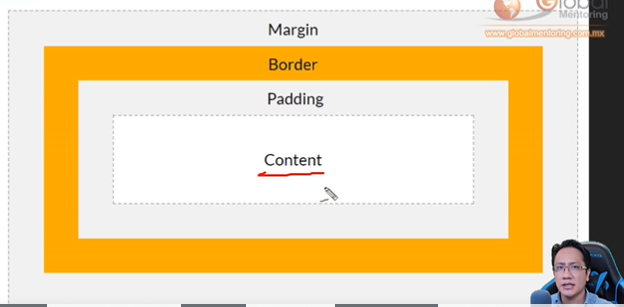
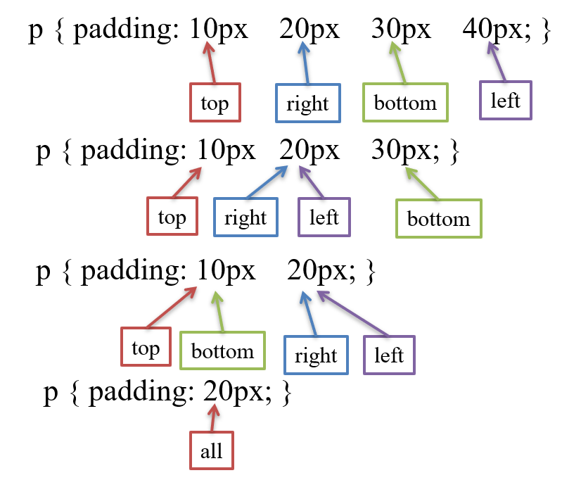
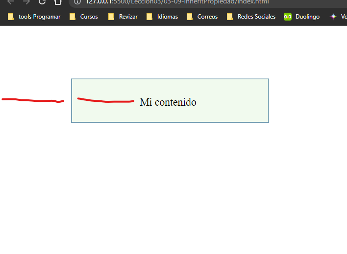
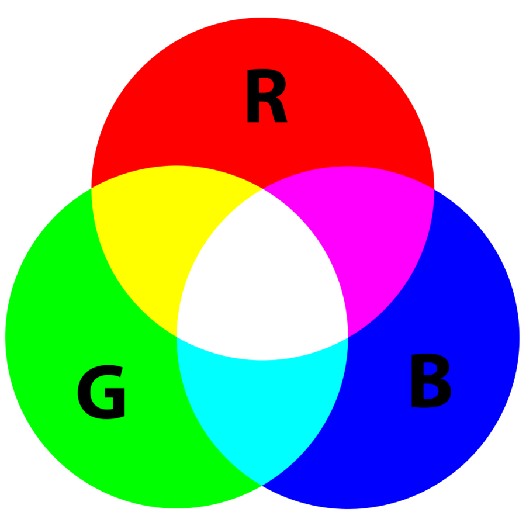
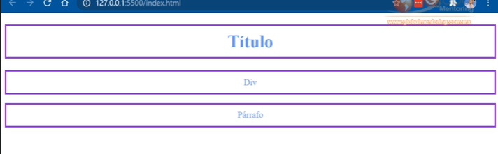
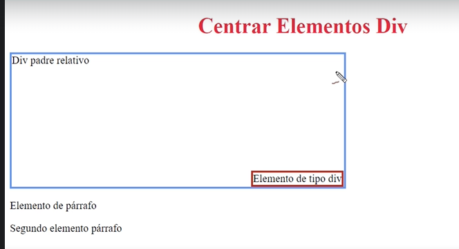

<H1>CURSO CSS UNI</H1>

- [**_Introduccion_**](#introduccion)
  - [Comentarios](#comentarios)
  - [Desendencia](#desendencia)
  - [Tipos de CSS](#tipos-de-css)
  - [Trucos <span style="color: RED"> **(TIPS)**</span>](#trucos--tips)
    - [Acentuar una frace con color](#acentuar-una-frace-con-color)
    - [Tecnica para poner fondo a las cartas (mas de 2 cartas)](#tecnica-para-poner-fondo-a-las-cartas-mas-de-2-cartas)
    - [Para hacer un indice](#para-hacer-un-indice)
- [**_COLORES, BORDES Y MAS_**](#colores-bordes-y-mas)
  - [Colores por nombre](#colores-por-nombre)
  - [Colores y Bordes](#colores-y-bordes)
  - [Manejo de Bordes](#manejo-de-bordes)
  - [Ancho de Bordes](#ancho-de-bordes)
    - [Como aplicar una medida distinta en cada lado?](#como-aplicar-una-medida-distinta-en-cada-lado)
- [**_Codigo de Colores en Bordes_**](#codigo-de-colores-en-bordes)
    - [Como aplicar un color distinto en cada lado?](#como-aplicar-un-color-distinto-en-cada-lado)
  - [Redondeo de bordes](#redondeo-de-bordes)
    - [Dominar las esquinas](#dominar-las-esquinas)
  - [Esquina Redondeada con fondo](#esquina-redondeada-con-fondo)
  - [Esquina redondeada con contorno](#esquina-redondeada-con-contorno)
  - [Borde con imagen de fondo](#borde-con-imagen-de-fondo)
  - [Borde Circular](#borde-circular)
  - [<details>](#details)
  - [Fondos Multiples](#fondos-multiples)
    - [Cuando la imagen es grande](#cuando-la-imagen-es-grande)
    - [Cuando queremos sobreponer una imagen encima de otra](#cuando-queremos-sobreponer-una-imagen-encima-de-otra)
    - [Para que la imagen ocupe todo el contenido usaremos](#para-que-la-imagen-ocupe-todo-el-contenido-usaremos)
    - [Cuando queremos contraste entre el fondo y la letra](#cuando-queremos-contraste-entre-el-fondo-y-la-letra)
- [**_BOX MODEL_**](#box-model)
  - [Width y Height en Box Model](#width-y-height-en-box-model)
  - [Margin](#margin)
  - [Outline](#outline)
  - [Outline-Offset](#outline-offset)
  - [**_PADDING_**](#padding)
  - [Box Sizing](#box-sizing)
  - [Propiedad Max-Width](#propiedad-max-width)
  - [Propiedad Margin: Auto](#propiedad-margin-auto)
  - [Propiedad **_inherit_**](#propiedad-inherit)
  - [Concepto de margin collapse (repetir)](#concepto-de-margin-collapse-repetir)
- [Propiedad Background](#propiedad-background)
  - [Background Atachment](#background-atachment)
- [**_Manejo de colores_**](#manejo-de-colores)
  - [Color por nombre HTML](#color-por-nombre-html)
  - [Manejo de colores **RGB**](#manejo-de-colores-rgb)
  - [Codigo de colores **Hexadecimal**](#codigo-de-colores-hexadecimal)
  - [Codigo de colores **HSL**](#codigo-de-colores-hsl)
- [**_Manejo de fondos_**](#manejo-de-fondos)
- [**Formato de texto**](#formato-de-texto)
- [**Fuentes**](#fuentes)
- [**Estilos de fuentes**](#estilos-de-fuentes)
- [Propiedad de Font-Size](#propiedad-de-font-size)
- [Google Fonts](#google-fonts)
- [Efectos con Google Fonts](#efectos-con-google-fonts)
- [**Atributo font**](#atributo-font)
- [Manejo de medidas](#manejo-de-medidas)
  - [Limitar medidas y porcentajes](#limitar-medidas-y-porcentajes)
      - [Porcentaje](#porcentaje)
      - [Unidades viewport](#unidades-viewport)
- [Menejo de Iconos](#menejo-de-iconos)
  - [Iconos Bootstrap](#iconos-bootstrap)
  - [Pasos para usar los iconos en Bootstrap](#pasos-para-usar-los-iconos-en-bootstrap)
- [Iconos de Google](#iconos-de-google)
- [Iconos de Ionicons](#iconos-de-ionicons)
  - [Manejo de Textos](#manejo-de-textos)
- [**Propiedad Display**](#propiedad-display)
  - [Display Block](#display-block)
  - [Display inline](#display-inline)
  - [Display None](#display-none)
- [**Posicionamiento de Elementos**](#posicionamiento-de-elementos)
  - [Centrar Div](#centrar-div)
  - [Posicionamiento Estatico](#posicionamiento-estatico)
  - [Tipos de posicionamiento](#tipos-de-posicionamiento)
  - [Posicionamiento Relativa](#posicionamiento-relativa)
  - [Posicionamiento Fixed (ajustado)](#posicionamiento-fixed-ajustado)
  - [Posicionamiento Absoluta](#posicionamiento-absoluta)
  - [Posicionamiento Sticky (pegajoso)](#posicionamiento-sticky-pegajoso)
  - [Posicionamiento Z-index](#posicionamiento-z-index)
  - [Propiedad Overflow](#propiedad-overflow)
  - [Propiedad Float](#propiedad-float)
  - [Propiedad Display Inline-Block](#propiedad-display-inline-block)
  - [**Menu** con la propiedad Display Inline-Block](#menu-con-la-propiedad-display-inline-block)
- [**Selectores**](#selectores)
  - [Selctores basicos](#selctores-basicos)
    - [Selector de <span style="color:red"> **Tipo**</span>](#selector-de--tipo)
    - [Selector de Clase (<span style="color:red"> **.**</span>)](#selector-de-clase--)
  - [Selector ID (<span style="color:red"> **#**</span> )](#selector-id---)
  - [Selector <span style="color:red"> **Universal**</span> (\*)](#selector--universal-)
  - [Selector de <span style="color:red"> **Atributo**</span>](#selector-de--atributo)
  - [Agrupar Elementos HTML y CSS](#agrupar-elementos-html-y-css)
  - [Subclases en CSS](#subclases-en-css)
  - [Selectores Combinados](#selectores-combinados)
    - [Selectores Decendientes](#selectores-decendientes)
    - [Selector Child](#selector-child)
    - [Selector Sibling (Adyacente)](#selector-sibling-adyacente)
- [**Pseudo Clases** <span style="color:yellow"> \***\*AQUI** **ME** **QUEDE\*\***</span>](#pseudo-clases--aqui-me-quede)
- [Pseudo Elementos](#pseudo-elementos)
- [Transparencia](#transparencia)
  - [Transparencia en imagenes](#transparencia-en-imagenes)
- [**Gradientes**](#gradientes)
- [**Sombras**](#sombras)
  - [Sombras para el texto](#sombras-para-el-texto)
  - [Sombras para las cajas](#sombras-para-las-cajas)
  - [Drop Shadow (sombras para imagenes sin fondo)](#drop-shadow-sombras-para-imagenes-sin-fondo)
    - [como removier el fondo de una imagen?](#como-removier-el-fondo-de-una-imagen)
- [**FLEXBOX**](#flexbox)
  - [justify-content: flex](#justify-content-flex)
  - [align-items](#align-items)
  - [align-content](#align-content)
  - [Modificar el size de manera individual](#modificar-el-size-de-manera-individual)
- [Especificidad, Herencia, Cascada.](#especificidad-herencia-cascada)
  - [Cascada](#cascada)
  - [Espesificidad](#espesificidad)
  - [Herencia](#herencia)
- [Estilos de Listas](#estilos-de-listas)
      - [List style type](#list-style-type)
      - [List style image](#list-style-image)
      - [List style position](#list-style-position)

## **_Introduccion_**

### Comentarios

> :bulb: **Tip:** Para comentar en CSS utilizamos `/**/`

```css
/*background-color: black;*/
```

### Desendencia

### Tipos de CSS

- Inline CSS

```css
<h1 style="color: blue; text-align: center; font-size: 100px">Universidad CSS</h1>
```

- Internal CSS

```css
<style>
h1{
  color:red;
  text-align: right;
  }
</style>
```

- External CSS
  - Esta es la mejor practica

> Podemos usar las teclas Ctrl + Space para selecionar las carpeta del css y despues seleccionar el archivo css

```
<link rel="stylesheet" href="css/estilos.css">
```

### Trucos <span style="color: RED"> **(TIPS)**</span>

#### Acentuar una frace con color

1. Hacemos un clase
   1. `.color-acento{ color: blueviolet; }`
2. Envolvemos la frase con la etiqueta `<span>` con la clase anteriormente dicha.absoluto

```html
<h2>Somos <span class="color-acento">ProgramaYa!</span></h2>
```

#### Tecnica para poner fondo a las cartas (mas de 2 cartas)

1. Primera carta (en css)
   1. `.carta:first-child{}` o child(1)
2. Secunda carta
   1. `.carta:nth-child(2){}`
3. Secunda carta
   1. `.carta:nth-child(3){}`
4. Adentro de las llaves, para dar un contraste entre el testo y la imagen

```css
background-image: linear-gradient(0deg, rgba(0, 0, 0, 0.5), rgba(0, 0, 0, 0.5)),
  url("media/front-end.jpg");
```

5. Las cartas deben estar en un contenedor (div) aparte, con una clase

#### Para hacer un indice

1. Agremanos los nombres de las secciones despues de #.
2. Para hacerlo mas **elegante** agregamos
   1. `html{ scroll-behavior: smooth; }` en el CSS

```css
header>
      <div class="container">
        <p class="logo">Programa Ya!</p>
        <nav>
          <a href="#somos-proya">Quienes somos</a>
          <a href="#nuestros-programas">Nuestros programas</a>
          <a href="#caracteristicas">Caracteristicas</a>
        </nav>
      </div>
    </header>
```

## **_COLORES, BORDES Y MAS_**

### Colores por nombre

[Pagina de Colores](https://htmlcolorcodes.com/color-names/ "enlase")

> RGB
>
> > R = Red(Rojo)  
> > G = Green(Verde)
> > B = Blue(Azul)

> hsl
>
> > h = hue(color, matiz)  
> > s = saturation(saturacion)
> > l = lightness(iluminacion)

> Los navegadores modernos soportan 140 colores con nombre. Los podemos usar en el código HTML y CSS por nombre, código Hex o el valor RGB.
> [Pagina de los colores](https://htmlcolorcodes.com/es/nombres-de-los-colores/)

### Colores y Bordes

Border se refiere al contorno, y los 10px al ancho de la linea del contorno, solid al tipo de contorno y por ultimo el color del la linea del border.

```css
.rojo {
  border: 10px solid firebrick;
}
```




### Manejo de Bordes

De esta forma solo modificamos el tipo de borde

```css
.discontinuo {
  border-style: dashed;
}
```

De esta forma solo modificamos el tipo y el grosor dl border

```css
.doble {
  border: 5px double;
}
```

Forma simplificada

```css
.solido {
  border: 10px solid red;
}
```

Forma completa

```css
.surco {
  border-width: 10px;
  border-style: groove;
}
```

De esta forma podemos modificar todos los lados del borde

```css
.mixto {
  border-style: dotted solid dashed double;
}
```

[Pagina para crear border radios](https://border-radius.com/)

### Ancho de Bordes

#### Como aplicar una medida distinta en cada lado?

```css
.punteado {
  border-style: dotted;
  border-width: 10px 5px 3px 2px;
}
```

Para poder visualizar los hanchos de los bordes podemos usar la consola y desplegar que medidas se estan aplicando.


## **_Codigo de Colores en Bordes_**

#### Como aplicar un color distinto en cada lado?

```css
.punteado {
  border-style: dotted;
  border-width: 10px 5px 3px 2px;
  border-color: crimson hotpink gold lime;
}
```

- Un valor de 1 en la transparencia = color completo.
- Un valor de 0 en la transparencia = complatamente transparente.
- Un valor de .5 en la transparencia = 50% de transparencia.

```css
.discontinuo {
  border-style: dashed;
  border-width: thick;
  /*thin, medium, thick*/
  border-color: hsla(203, 39%, 44%, 1);
  border-color: hsla(203, 39%, 44%, 0);
  border-color: hsla(203, 39%, 44%, 0.5);
}
```

### Redondeo de bordes

> Podemos crear links que parescan botones, pero mas estilizados.

Cuando el `border-radius: 20px;` lleva un unico valor se proporsiona en totas las esquinas

```css
.solido {
  border: solid red;
  border-width: 5px;
  border-radius: 20px;
}
```

#### Dominar las esquinas

```css
#b4 {
  border-radius: 15px 50px 30px 5px;
  background-color: red;
  padding: 20px;
  width: 200px;
  height: 150px;
}
```

- En el border-radius **15px** es la esquina superior izquierda.
- En el border-radius **50px** es la esquina superior derecha.
- En el border-radius **30px** es la esquina inferior derecha.
- En el border-radius **5px** es la esquina inferior izquierda.

Aqui seria de forma simplificada

```css
.redondeado {
  border: 5px solid blueviolet;
  border-radius: 20px 0px 10px 0px;
}
```

> :bulb: **Tip:** Con `border-radios:` <span style="color: yellow"> **Podemos hacer las esquinas redondeadas**</span>

### Esquina Redondeada con fondo

> :bulb: **Tip:** Usaremos `background-color:`

> :bulb: **Tip:** El borde se puede ver hasta que le damos un color y unas medidas.

```css
#b1 {
  border-radius: 25px;
  background-color: greenyellow;
  padding: 20px;
  width: 200px;
  height: 150px;
}
```

### Esquina redondeada con contorno

> :bulb: **Tip:** Usaremos `border:`

```css
#b2 {
  border-radius: 25px;
  border: 2px solid blueviolet;
  padding: 20px;
  width: 200px;
  height: 150px;
}
```

### Borde con imagen de fondo

> :bulb: **Tip:** Usaremos `background-image:`  
> :bulb: **Tip:** Y para darle una dimencion usaremos `background-position:` y para indicar que parte de l imagen se mostrara `left top;`  
> :bulb: **Tip:** si no ocupa todo el tamano que se repita con `background-repeat: repeat;`

```css
#b3 {
  border-radius: 25px;
  background-image: url(fondo.jpg);
  background-position: left top;
  background-repeat: repeat;
  padding: 20px;
  width: 200px;
  height: 150px;
}
```

### Borde Circular

> :bulb: **Tip:** Para hacerlo circular usaremos `border-radius: 50%;` pero utilizaremos % en ves de pixeles

```css
#b5 {
  border-radius: 50%;
  background-color: blue;
  padding: 20px;
  width: 200px;
  height: 150px;
}
```



### <details>

<summary> Como hacer una imagen o una caja❓</summary>
usaremos `border-radius: 50%;` pero esto funciona solo cuando la imagen o la caja es un cuadrado, tenemos que dar una medida igual en el `width` y en el `height`, si el resutado distrociona la imagen podemos usar `object-fit: cover;` para solucionarlo
</details>

### Fondos Multiples

> :bulb: **Tip:** Cuando la imagen es mas pequena que el marco se repite, en ese caso usaremos `no-repeat`

`background: url(img/gato.png) top 40px left 40px / 80px no-repeat;`

backgruound(ruta)(posicion)(dimencion) no-repeat  
valores (top, right,bottom, left, center)
arriba, derecha, abajo, izquierda, cdntro.

#### Cuando la imagen es grande

usaremos la dimencion, para hacerlo mas pequeno y para no repetir la imagen solo usarenos no-repiear

#### Cuando queremos sobreponer una imagen encima de otra

Primero llamaremos a la imagen que va estar enciama `background: url(img/plato.png) center/ 180px no-repeat,` y usaremos una coma para ceparar y llamar a la segunda imagen `url(img/mesa.png) center/`lo separamos con diagonal y usaremos cover para que puedan convivir las 2 imagenes juntas `cover` y por ultimo para no tener ningun problema usaremos `no-repeat;`

#### Para que la imagen ocupe todo el contenido usaremos

`background-size: contain;`

#### Cuando queremos contraste entre el fondo y la letra

```css
background-image: linear-gradient(0deg, rgba(0, 0, 0, 0.5), rgba(0, 0, 0, 0.5)),
  url("media/hero.jpg");
```

con esto oscurecemos el fondo para resaltar el texto, solo agregamos esto antes el url `linear-gradient( 0deg, rgba(0,0,0,0.5),rgba(0, 0, 0, 0.5)) ,`

## **_BOX MODEL_**

El padding y el Margin son transparentes y el border puede tener color.




### Width y Height en Box Model

El Width representa el ancho y el Height el alto de un elemento si vien esta propiedades no son requeridas para que un elemento se muestre, si son requeridas si un elemento no tiene contenido.

### Margin

> :bulb: **Tip:** El margin engloba otras propiedades.

- top (arriba)
- bottom (abajo)
- left (izqierda)
- right (derecha)

```css
margin-top: 50px;
margin-bottom: 30px;
margin-right: 25px;
margin-left: 30px;
```

Aqui de forma simplificada

`margin: 50px 30px 25px 30px;`
`margin: 0px 20px 0px 0px;`
`margin:top right bottom left;`

> :bulb: **Tip:** El orden es como las manecillas del reloj

### Outline

Este se encuentra entre el margin y el border,
le podemos dar color y estilo de border. Se puede sobreponer a otros elementos.

```css
outline: 10px outset #a8dadc;
```

### Outline-Offset

Este se inserta entre el border y el Outline, solo se le puede aplicar un solo valor. No se le puede aplicar color.

### **_PADDING_**

Se encuentra entre el border y el contenido.

Para darle espacio al texto con la caja.

```css
.box2 {
  padding: 20px;
  background: REBECCAPURPLE;
  /* color: white; */
  margin-top: 30px;
  margin-left: 20px;
  overflow: hidden;
  border: 2px solid steelblue;
}
```

```css
padding-top: 50px;
padding-bottom: 30px;
padding-right: 25px;
mpaddin-left: 30px;
```

`padding: 50px 30px 25px 30px;`
`padding: 0px 20px 0px 0px;`
`padding:top right bottom left;`

> :bulb: **Tip:** El border y el padding si afactan al width y el height, para que no lo afecte usaremos la propiedad `box-sizing: border-box`, si el contenido sale de la caja puedes usar `overflow: hidden;` lo que se desborda lo esconde




### Box Sizing

CSS utiliza el box-content, pero no incluye el width ni el padding ni border.

> :bulb: **Tip:** Si no queremos pasarnos de la medida que le indicamos al width debemos utilizar `box-sizing: border-box`

> :bulb: Esta propiedad hace que cuando agregamos margin, padding o border a los elmntos no creesca mas del tamano que le dimos.


### Propiedad Max-Width

Esta propidad la ocuparemos para que no aparesca la barra de escrol y para indicar hasta donde puede maximo ajustarse. Tambien lo podemos usa en el max-height.
se pueden usar en pixeles o en porsentaje.

`max-width: 100%;`

`max-width: 300px;`

`max-height:100px;`

### Propiedad Margin: Auto

Lo utilizaremos para centrar un elmento.
Con `margin: auto` va atomar automaticamente un por partes iguales el lado izquierdo como el lado derecho quedando asi <span style="color:red"> **centrado**</span>.

La propiedad de ` 0 auto;` el cero va atomar la parte superior (top) e infrior (bottom) y l auto el lado derecho (right) e izquierdo (left), siempre y cuando sean elementos inline.

`margin: 0 auto;`


### Propiedad **_inherit_**

Donde colocamos el inhrit va heredar la propiedad del elemento padre, no olvidar colocar una clase. sin inherit se tomara su valor por default.



```css
div {
  padding: 10px 15px 5px 3px;
  border: 1px solid #457b9d;
  margin-left: 100px;
  background-color: #f1faee;
  max-width: 300px;
  box-sizing: border-box;
}

p.interno {
  margin-left: inherit;
}
```

### Concepto de margin collapse (repetir)

Esto ocurre cuando tenemos dos cajas, y se aplica en los margenes inferior y superior.

El margen se junta con el margn del elemnto inferior, tomando un solo margen para los dos,
si el margen del elemento supeior es mayor ese es el que se toma. **_Los margenes no se suman_**


## Propiedad Background

Sirve para poner fondos de colores al elemento que debe tener un width y un height, pero tambien podemos poner gradientes e imagenes de fondo.

`background-color: rgb(100, 100, 250);` Le da color al elmento.

`background-color:transparent;` Pone transparente el background.

`background-image: url(img/imagen.png);` nos permite poner una imagen de fondo

`background-repeat: no-repeat;` Hae que no se repita la imagen

`background-position: 30px 100px;` El primer valor es y i si es negativo lo va amover a la izquierda y pisitivo a la derecha, el segundo valor es x y lo va a mover arriva si es negativo y abajo si es positivo. Tambien podemos usar palabras resrvadas `background-position: top bottom left right center;` solo podemos usar dos valores para posicionar el elemento. Si lo usamos con pixeles lo va empujar dependiendo de la palabra reservada qu utilicemos `background-position: top 10px right 30px;`

`background-size:70% 300%;` Modificar el Tamano de la imagen y Podemos usar tambien pixeles

`background-size: contain;` Escala la imagen al mayor tamano posible sin recortar y sin estirar a la imagen.

`background-size: cover;` Escala la imagn sin estiararla y recorta para que ocupe todo el elemento.

### Background Atachment

`background-atachment: fixed;` Nos permite modificar que tan fijo es la imagen. LO usaresmo cuando ocupemos el 100% del width y casi el 100% del height en el navegador. Nos da un efecto paralax

## **_Manejo de colores_**

### Color por nombre HTML

[Pagina de Colores por nombre](https://htmlcolorcodes.com/color-names/)

### Manejo de colores **RGB**



El rgb tambien maneja el concepto de transparencia, se le conoce como alpha, es significa que se va intigrar con el color de fondo.

Si ponemos el valor de **1** no tenemos transparencia y si ponemos **0** tenemos la mayor transparencia, y para tener el 50% de transparencia usamos el **.5**

- r = Red `rgb(255,0,0)`
- g = Green `rgb(0,255,0)`
- b = Blue `rgb(0,0,255)`
- a = Alpha `rgb(255,0,0,.5)`

```css
.rgb {
  background-color: rgb(131, 56, 236);
}
.rgba {
  background-color: rgba(131, 56, 236, 0.5);
}
```

### Codigo de colores **Hexadecimal**

- Se compone de 6 digitos.
- Se inicia con #.
- Tambien podemos usar transparencia agregando 2 digitos mas
  - `#0090adff` no hay transparencia
  - `#0090ad00` maxima transparencia
  - `#0090ad88` 50% de transparencia
- El primer par corresponde al color rojo `#ff0000` seundo par es verde `#00ff00` y el tercer par es azul `#0000ff.
- Pa simplificar por pares podemos usar solo un numero o letra `#fa2` = `#ffaa22`

### Codigo de colores **HSL**

El hsl tambien maneja el concepto de transparencia, se le conoce como alpha, es significa que se va intigrar con el color de fondo.

Si ponemos el valor de **1** no tenemos transparencia y si ponemos **0** tenemos la mayor transparencia, y para tener el 50% de transparencia usamos el **.5**

- h = Hue `hsl(195, 100%, 50%)` el 195 se toma de una rueda de colores.
- s = Saturation `hsl(85, 100%, 50%)` es un porsentaje que va del 0% al 100%
- l = Lightnees `hsl(20, 50%, 100%)` la iluminacion es un porsentaje que va del 0% al 100%
- a = Alpha `hsl(195,100%,50%,.5)`


## **_Manejo de fondos_**

```css
body {
  background-color: dodgerblue;
  color: cornsilk;
  background-image: url("/img/fondo.png");
  background-repeat: no-repeat;
}
```

- Aplicar un `background-color: dodgerblue;` a toda nuestra pagina web.
- Aplicar imagen de fondo `background-image: url("/img/fondo.png");`
- Poner un color de fondo paraecido al de la imagen.
- Usaremos `background-repeat: no-repeat;` para que al hacer mas pequena la pagina el fondo no se repita.

De esta forma podemos simplificar

```css
body {
  color: cornsilk;

  background-attachment: fixed;
  background: dodgerblue url("/img/fondo.png") no-repeat right top;
}
```

## **Formato de texto**

1. color y fondo, se recomienda tener un contraste con la fuente.
   1. `color: #ef476f;`
   2. `background-color: #219ebc;`
2. Aliniar el texto.
   1. `text-align: center;`
3. Convertir todo a mayusculas.
   1. `text-transform: uppercase;`
4. Sombra al rededor de la fuente.
   1. `text-shadow: 2px 2px 2px #ced4da;`
5. Separar las letras
   1. `letter-spacing: 3px;`
6. Se parar las palabras.
   1. `word-spacing: 10px;`
7. Justificar texto.
   1. `text-align: justify;`
8. Direccion del texto.
   1. `direction: rtl;`
9. Se usa para elementos de texto pero mas para links
   1. `text-decoration: overline;` Linea encima del texto
   2. `text-decoration: line-through;` texto tachado
   3. `text-decoration: overline underline;`Texto envuelto entre dos lineas.
10. Indentacion
    1. `text-indent: 30px;`
11. Espacio entre lineas.
    1. `line-height: 1.5;`
12. `white-space: normal;` Para que el texto de un enter al final de lo que lo envuelve. `white-space: normal;` no envuelve el contenido en el div.

## **Fuentes**

Tipos de funtes mas representativas.amarillo

- Times New Roman (serif)
- Georgia (serif)
- Arial (sans-serif)
- Verdana (sans-serif)
- Courier New (monospace)
- Lucida Handwriting (cursive)

Para aplicar el tipo de funte utilizaremos `font-family:` nos despliega varias opciones, devido a que algunas no se pueden reconoser por el navegador, por si falla alguna pueda mostrar otra.

> :bulb: **Tip:** Si en el nombre de la funte tenemos espacios utilizaremos comillas.
> :bulb: **Tip:** La fuentes de tipo serif son las que tienen las puntas redondiadas.

```css
.fuente_times {
  font-family: "Times New Roman", Times, serif;
}
```

## **Estilos de fuentes**

`font-style:`

- italic
- normal
- oblique
- inherit
- initial
- unset

`font-weight:`

- Ancho de la funte
- 100 a 900
- bold (negritas)
- bolder (mas ancho)
- lighter (mas angosta)
- normal

`font-variant:`

- normal
- small-caps (La primera letra en mayuscula, mas alta)
- inherit
- initial
- unset

## Propiedad de Font-Size

`font-size:`

> :bulb: **Tip:** La usaremos para incrementar el tamano de la fuente.

- large
- larger (mas grande)
- medium
- small ( no es responciva)
- smaller (mas pequena)
- x-larger
- x-small
- xx-larger
- xx-small

Tambien podemos utilizar un valor

- pixeles (`16px`)
- 1em (es igual a 16px)
  > :bulb: **Tip:** No es soportardo en verciones anteriores de internet explorer.
- 3vw
  > :bulb: **Tip:** tomo en cuenta el alto y ancho de la pantalla w - weight (ancho) h - height (alto)  
  > :bulb: Es una fuente responciva  
  > :bulb: no esta soportado en todos los navegadores.

## Google Fonts

Aqui podremos encontrar muchas funtes de forma gratuita. [Google Fonts](https://fonts.google.com/)

> :bulb: **Tip:** Hay que considerar que puede tardar mas la pagina para cargarse, amenos que descarguemos la fuente y la incluyamos en la aplicacion web.

Hay dos formas de utilizar las fuentes de google.

- `<link>`
  - > :bulb: **Tip:** Esta va insertada en el documento html
- `@import`
  - > :bulb: **Tip:** Esta va insertada en el documento CSS, se pega en la parte de arriva si la etiqueta style

Al final de la pagina en el titulo **pairings** podemos ve que fuente convina con la que selecionamos.

Para utilizarla en un titulo

usaremos `font-family:` y en la pagina de google copiaremos donde dice **CSS rules to specify families**

Si queremos importar varias fuentes de google solo copiamos otra fuente con `@import` y la pegamos abajo de la primera

> :bulb: **Tip:** Podemos reutilizar la misma linea de codigo para incluir mas fuenstes.

`@import url('https://fonts.googleapis.com/css2?family=Sofia&family=Roboto&display=swap');`  
se agrega && family mas el nombre de la fuente.

## Efectos con Google Fonts

Aqui la [guia](https://developers.google.com/fonts/docs/getting_started)

> :bulb: **Tip:** No lleva 2 en css

@import url('https://fonts.googleapis.com/**css**?family=Sofia|Roboto&effect=shadow-multiple&display=swap');

`https://fonts.googleapis.com/css?family=Rancho&effect=shadow-multiple|3d-float`

## **Atributo font**

Lo podemos hacer de una forma reducida o simplificada.

```css
.fuente_roboto{
    /*
    font-family: 'Roboto', sans-serif;
    font-style: normal;
    font-weight: normal;
    font-variant: small-caps;
    font-size: 20px;
    */
    /*font: font-style font-variant font-weight *font-size/line-heigth *font-family;*/
    font: italic small-caps bolder 20px Roboto, sans-serif;
```

## Manejo de medidas

- Pixeles: Simpre van hacer fijos
- Rem: Es relativa, depende eel font-sixz del html, se recomienda su uso en textos. Su base son 16px
- EM: Es relativo al size de fuente del padre o del mismo elemento, se acumula en cascada.

### Limitar medidas y porcentajes

`max-width:400px`
`max-height:400px`

`min-width:200px`
`min-height:200px`

`width: 100px`

##### Porcentaje

`width:70%` Los porcentajes son relativos al padre.

> :bulb: **Tip:** Para usar porcentajes con height necesitamos equeel padre tenga un height definido.

##### Unidades viewport

El viewport es lo que podemos visualizar en pantalla, lo ancho (vw) y lo alto (vh), va del 1 al 100. Es adaptable en pantalla.

`width: 50vw`
`height: 100vh`

## Menejo de Iconos

### Iconos Bootstrap

Pagina de iconos de [Bootstrap](https://icons.getbootstrap.com/)

### Pasos para usar los iconos en Bootstrap

1. Click en install
2. CDN Link publico. (lo podemos descargar **download** y lo podemos instalar en nuestro proyecto **npm**)
3. Hay 2 opciones
   1. Agregar un `<link>` va en el HTML
   2. Importarla `@import` Va en el CSS
4. Lo pegamos en el HTML
5. Despues elegimos un icono en la pagina y nos dara 3 opciones.
   1. Icon font (HTML)
   2. Code point
   3. Copy HTML (SVG)

Podemos modificar su tamano y color

## Iconos de Google

Pagina de [icons Google.](https://fonts.google.com/icons?selected=Material+Icons&icon.style=Outlined)

Para usarlos.

1. Click en [developer guide](https://developers.google.com/fonts/docs/material_icons)
2. La forma más sencilla de configurar las fuentes de íconos para usarlas en cualquier página web es mediante Google Fonts. Lo único que debes hacer es incluir una sola línea de HTML:

```css
<link href="https://fonts.googleapis.com/icon?family=Material+Icons" rel="stylesheet">
```

3. Lo pegamos en el HTML.
4. El nombre del icono se va especificar como el valor de este elemento.

```css
<p>
    <i class="material-icons">search</i>
       Búsqueda
</p>
```

`vertical-align: bottom;` Podemos aliniar el icono con el texto y el parrafo.

## Iconos de Ionicons

Pagina de [ionicons](https://ionic.io/ionicons)

Pasos para usarlos iconos

1. Click en [usage](https://ionic.io/ionicons/usage)
2. Colocar el link antes del `<body>` ya que es un archivo de javascript

```js
<script type="module" src="https://unpkg.com/ionicons@5.5.2/dist/ionicons/ionicons.esm.js"></script>
<script nomodule src="https://unpkg.com/ionicons@5.5.2/dist/ionicons/ionicons.js"></script>
```

3. Usaremos los iconos de esta forma.

```html
<p>
  <ion-icon name="checkmark-done-outline" class="icono_azul"></ion-icon>
  Listo
</p>
```

> :bulb: **Tip:** Por cada link que agreguemos la pagina web se va a demorar mas en cargar.

### Manejo de Textos

<details>
<summary> Que significa text-align❓</summary>
Aliniar un texto o justifcar.
</details>

`text-align: justify;` Justifica al texto. pero separa las palabras, no es muy remomendable usarlo

`letter-spacing: 20px;` es para juntar o separar las letras usando valores positivos y negativos

`word-spacing: 30px;` es para definir el espaciado entre cada palabra

`text-shadow: 3px 3px 6px rgb(0, 0, 0, 05)` es para darle una sombra al texto

`text-transform:uppercase;` es para transformar el texto por ejemplo a mayusculas, minusculas `lowercase`, poner una mayuscula alprincipio de cada palabra `capitalize`

`line-height: 30px;` define la altura de cada line del texto

`text-decoration-line:` Underline significa subrayalo, esta propiedad se divide en tres, line style, color,

- underline pone una line abajo del texto
- overline pone una line arriba del texto
- line-through tacha el texto

se pueden convinar. `text-decoration-line: line-through overline underline;` usa las tres lineas

Para quitar la line usaremos none.

`text-decoration-style: wavy;` Podemos cambiar el estilo de la lineas

`text-decoration-color: crimson;` Aplica el color a la linea

## **Propiedad Display**

### Display Block

Nos va permitir mostrar o uccultar elementos o tambien modificar la forma en que se muestran algunos elementos HTML

Etiquetas con propiedad display block, van ocupar una nueva linea por completo

```html
<h1>Título</h1>
<div>Div</div>
<p>Párrafo</p>
```

```html
<ul>
  <li>Item 1</li>
  <li>Item 2</li>
  <li>Item 3</li>
</ul>
```



### Display inline

`<span>`  
`<a href="#">Link 1</a>`

<details>
<summary> Como volver un elemento block a inline❓</summary>
Para modificar los elementos de block y se muestren en una sola linea usaremos.

`display: inline;`

</details>


### Display None

Con `display: none;`podemos ucultar ese elemento, ya no ocupa el espacio, a diferencia de `visibility: hidden;` que mantiene el espacio.

## **Posicionamiento de Elementos**

### Centrar Div

1. Asignar un tamano `width: 50%;`
   1. cuando usamos porcentajes este cambia conforme cambia el tamano de la ventana.
   2. tambien podemos usar `max-width: 50%;`
2. Border `border: 3px solid firebrick;`
3. margin `margin: auto;`
   1. con auto el espacio del lado derecho e izquierdo se vuelve el mismo, y se **centra**.

### Posicionamiento Estatico

### Tipos de posicionamiento

🔴 static  
🔴 relative  
🔴 fixed  
🔴 absolute  
🔴 sticky

> :bulb: **Tip:** Cuando usamos static no podremos utilizr top: left: ...

### Posicionamiento Relativa

Con esta posicion si va a fectar el top: left: botton: right:

`position: relative;`

> :bulb: **Tip:** Si tenemos otros elementos, no afectaran al div, siempre seguira reservando su espacio.

### Posicionamiento Fixed (ajustado)

Es util para menus de navegacion o botones de chat. ya que siempre se va amantener fijo. Se ajusta al <span style="color:red"> **VIEWPORT**</span>

`position: fixed;`

> :bulb: **Tip:** No se reserva su espacio

### Posicionamiento Absoluta

Normalmente la utilizaremos dentro de otro elemnto **DIV**

> :bulb: **Tip:** Si no esta dentro de un DIV este tomara el body.  
> :bulb: El div padre no debe ser de tipo estatic

`position: absolute;`



### Posicionamiento Sticky (pegajoso)

> :bulb: **Tip:** Para que funcione tenemos que usar top, right , bottom o left

> :bulb: **Tip:** Funsiona de manera relativa hasta el momento que sale de pantalla, entonces se vuelve como un fixed

> :bulb: **Tip:** Consideraciones Si estamos trabajando con safari usaremos una coreccion. `position: -wekit-sticky;` y no funciona en internet explorer.

### Posicionamiento Z-index

Nos sirve para poder mostar elementos por detras o ensima de otros.

`z-index: -1;` se mostrara atras de el primer elemento.  
`z-index: 1;` se mostrara por encima de el primer elemento.

### Propiedad Overflow

Es cuando el texto se sale de nuestro contenedor.

`overflow:visible;` muestra todo lo que sale del elemento. Es la propiedad por default

`overflow: hidden;` Todo lo que se sale se va ocultar.

`overflow: scroll;` Se va amostrar dos barras con scroll para poder ver todo el contenido

`overflow: auto;` Solo va a mostras las varras de scroll necesarias.

> :bulb: **Tip:** Esta propiedad solo se va poder travajar si especificamos un alto (height), ya que al quitar el height se deslplagara todo el contenido en el elemento div

> :bulb: **Tip:** Lo podemos configurar para el ejex o eje y con `overflow-x: o overflow-y:` y podemos usarlo con las propiedades anteriores.

### Propiedad Float

Con esta propiedad podemos colocar mas elementos en la misma linea. Cuado ya no caben se pasan ala siguiente linea

`float: left;` `float: right;`

> :bulb: **Tip:** Para poder a gregar mas elentos en otra linea, cortando la propiedad de float usaremos `clear: both;` para limpiar los dos lados o left, right para elegir que lado limpiar

### Propiedad Display Inline-Block

Con esta propiedad `display: inline-block;` podemos controlar el alto (height y padding) de los elementos incluso si son de tipo inline. Con esto va adquirir las dos caracteristicas, inline y block y asi poder aplicar las propiedades

### **Menu** con la propiedad Display Inline-Block

Con esta propiedad podemos usar una lista como un meno sin necesidad de flotar los elementos.

## **Selectores**

<details>
<summary> Que son los selectores❓</summary>
Definen a que lementos se les aplicara los estilos que hayamos establecido, el selector cambiara a todos los elementos que coincidan con dicho selector.  
</details>

### Selctores basicos

#### Selector de <span style="color:red"> **Tipo**</span>

> :bulb: **Tip:** Selecciona todos los elementos que coinciden eon el nombre del elemento especificado

```css
h2 {
  color: steelblue;
}
```

#### Selector de Clase (<span style="color:red"> **.**</span>)

> :bulb: **Tip:** Selecciona todos los elementos que tienen el atributo class. Sintaxis: .classname

Ejemplo:

```css
.borde {
  border: 1px solid black;
}
```

```html
<p class="centrar texto_grande">Iniciando el curso de CSS</p>
<p class="centrar">www.globalmentoring.com.mx</p>
```

```css
.😂 {
  border: 1px solid black;
  font-size: 20px;
}
```

> No usar numeros al inicio y si son dos palabras separar con \_ o -. Eso lo usaremos para <span style="color:red">**reutilizar**</span> en otros elementos de html

> Para agregar otra clase al mismo elemento so hay que dejar un espacio e insrtar el nobre de la segunda clase.

### Selector ID (<span style="color:red"> **#**</span> )

> Este tipo de selector lo usaremos para modificar un elemento html que <span style="color:red">**es unico**</span> dentro de nuestra pagina y no se repite, como por ejemplo el **H1**

```html
<h1 id="titulo">Universidad CSS</h1>
```

Utilizar selector id es una mala practica

### Selector <span style="color:red"> **Universal**</span> (\*)

> Este tipo de selector se aplica a toda nuestra pagina HTML. Como buena practica lo posicionaremos al inicio de nuestro documento css.

```css
* {
  background-color: ghostwhite;
  color: cornflowerblue;
}
```

### Selector de <span style="color:red"> **Atributo**</span>

```css
[href] {
  text-decoration: none;
}
```

### Agrupar Elementos HTML y CSS

> Esto para aplicar los mismos estilos a varios elementos html o tambien clases o selctores. Los podemos convinar o agrupar.

```css
h1,
h2,
p,
div {
  color: crimson;
  text-align: center;
}
```

### Subclases en CSS

> Utilizamos una clase que se aplicara a los elementos de html que sean del mismo tipo que seleccionamos (etiqueta p).

```css
p.centrar {
  text-align: center;
}
```

```html
<p class="centrar">Iniciando el curso de CSS</p>
<p class="centrar">www.globalmentoring.com.mx</p>
```

### Selectores Combinados

#### Selectores Decendientes

> :bulb: **Tip:** Una ves que selecciones un elemento se va aplicar el estilo que hemos configurado para todos los elementos decendientes sin importar si son elementos directos e indirectos. Aun que esten dentro de otra equiqueta s les va aplicar las propiedades que asignemos.

```css
div.contenedor.descendiente p {
  background-color: #fdffb6;
}
```

> :bulb: **Tip:** Solo necesitamos ponr la clase un espacio y las etiquetas que queremos afeactar.

#### Selector Child

> :bulb: **Tip:** Para afectar solo a los hijos de un div utilizarmos div.la clase espacio > p. para dejar fuera a otros parrafos que esten dentro de otra etiqueta que asu ves estan dentro del div.

```css
div.contenedor.hijo > p {
  background-color: #ffc6ff;
}
```

#### Selector Sibling (Adyacente)

> :bulb: **Tip:** Se usa el signo +, va afectar al parrafo que se encuentre ensegida del div con la clase que seleccionamos, pero solo va a fectar a ese parrafo.

```css
div.contenedor.adyacente + p {
  background-color: #caffbf;
}
```

> :bulb: **Tip:** selector hermano, se leciona al que esta almismo nivel

```css
div.contenedor.hermano ~ p {
  background-color: #9bf6ff;
}
```

## **Pseudo Clases** <span style="color:yellow"> \***\*AQUI** **ME** **QUEDE\*\***</span>

<details>
<summary> Que es la PseudoClase?</summary>
Esuna palabra clave que se anade alos selectores y que especifica un estado especial del elemento seleccionado.
</details>

> :bulb: **Tip:** Las pseudo clases nos van a permitir manipular ciertos estado de nuestro de nuestros elementos HTML

Podemos cambiar el color de fondo al pasar el mause un div. Esto con <span style="color:red"> **:hover**</span>

```css
div.contenedor:hover {
  background-color: #457b9d;
  color: #f1faee;
}
```

Podemos ocultar y mostrar al pasar el mause un parrafo. Esto con <span style="color:red"> **:hover**</span>

```css
div.contenedor.oculto p{
    display: none;
}
div.contenedor.oculto:hover p{
    display: block;
    background-color: #a8dadc;
    color: #023e8a;
    padding: 15px;
```

> :bulb: **Tip:** Otra pseudo clase es `first-child`

```css
div.contenedor.primero p:first-child {
  font-variant: small-caps;
}
```

## Pseudo Elementos

<details>
<summary> Que es un PseudoElemento</summary>
Se anaden a los selectores, pero no describen un estado especial sino que, permiten <span style="color:red"> **anadir estilos a una parte concreta del documento.**</span>
</details>

Funciona cuando seleccionamos el texto con el mause

```css
div.contenedor p::selection {
  color: red;
  background-color: yellow;
}
```

Funciona cuando seleccionamos el texto con el mause, pero solo en la primera linea del parrafo, funciona de forma dinamica, si hacemos zoom solo aplicara para la primera linea.

```css
div.contenedor p::first-line {
  font-variant: small-caps;
  color: red;
}
```

Funciona para cambiar la primera letra de cada parrafo que este dentro del div

```css
div.contenedor p::first-letter {
  font-size: 1.5em;
}
```

Funciona para agregar palabras o signos al principio o al final del parrafo.

```css
div.contenedor p::before {
  content: "- ";
}

div.contenedor p::after {
  content: " -";
}
```

## Transparencia

### Transparencia en imagenes

> :bulb: **Tip:** Lo podemos usar para una galeria de imagenes

```css
img {
  opacity: 0.5;
}
img:hover {
  opacity: 1;
}
```

## **Gradientes**

Paginas para gradientes

- [CSS Gradient](https://cssgradient.io/)
- [webgradients.com](https://webgradients.com/)
- [uigradients.com](https://uigradients.com/#Martini)

> :bulb: **Tip:** Los gradientes nos permiten añadir efectos de colores degradados en nuestros diseños. Los gradientes están disponibles desde CSS3 y se configuran como fondos, por lo que tendremos que usar la propiedad “background“. Disponemos de dos tipos de gradientes: lineal y radial.

```CSS
body {
  background: linear-gradient(#f72585, #3a0ca3);
}1
```

Podemos modificar los parametros, agregando mas infrmacion. Por defaul el gradiente empieza de la parte superior a la parate inferior.

`background: linear-gradient( to bottom right, #24404d, #6dbff1 #black);

`background: linear-gradient( 180deg, #24404d, #6dbff1 #black);

`background: radial-gradient( circle, #24404d, #6dbff1 #black);

## **Sombras**

### Sombras para el texto

`text-shadow: 1px 2px 3px rgba(32,32,32,0.3);`

Valores por orden

- 1px eje x Desplazamiento en la horizontal
- 2px eje vertical (ancho) Desplazamiento en la vertical
- 3px Desenfoque (blur = difuminado)
- rgba Color de la sombra

### Sombras para las cajas

> :bulb: **Tip:** Estas se consiguen con el atributo «box-shadow», lo podemos usar solo utilizando los 2 primeros valores y la sintaxis sería la siguiente:

Esto ocurre cuando usamos solo dos valores, currentColor es una variable que utiliza el color por defecto
`box-shadow: 10px 10px 0 0 currentColor;`

`box-shadow: h-offset v-offset blur spread color;`

`box-shadow: 1px 1px 1px 1px rgba(32,32,32,0.3);`

Por orden de aparición, los valores de unidades entregadas a box-shadow son los siguientes:

- Desplazamiento de la sombra en la horizontal
- Desplazamiento de la sombra en vertical
- Desenfoque de la sombra
- Propagación de la sombra
- Color aplicado

Con el primer valor podemos mover la sombra a la izquierda -15 o derecha 15

Con el segundo valor el eje y, podemos mover la sombra hacia arriba o hacia abajo.

El tercer valor no soporta valores negativos

Con el cuarto valor **spread** = propagar podemos hacer crecer la sombra

Los 4 valores iniciales los podemos entregar en distancia, por ejemplo píxeles. El último valor será un color. El color puede ser un RGB normal, pero es muy habitual que acabemos usando un RGBA porque le aplicará también una transparencia en el color de la sombra.

### Drop Shadow (sombras para imagenes sin fondo)

De esta forma le podemos dar fondo a las imagenes que no tienen fondo (png)

`filter: drop-shadow(0 0 40px gold):`

#### como removier el fondo de una imagen?

[Pagina para remover fondos de la imagen]()

## **FLEXBOX**

Con flexbox es mas sencillo acomodar los elementos

1. Con `diplay: flex;` Colocamos las listas de manera vertical y en una sola linea.
2. Con `flex-direction:` posee cuatro posibles valores:
   1. row (horizontal por defaul cargandose del lado ixquierdo)
   2. row-reverse (se cargan del lado derecho y de forma inversa)
   3. column (Se acomodan de la parte superior a la inferor)
   4. column-reverse (Para mostar de forma inversa)
3. Con `flex-wrap: wrap` lo usaremos cuando son mas elementos, para que al hacer mas pequena la pagina, los elementos pasen de forma automatica a la parte inferior.
4. Se pueden combinar las propiedades `flex-direction` y `flex-wrap` en la abreviatura `flex-flow` . El primer valor especificado es flex-direction y el segundo valor es flex-wrap.

### justify-content: flex

> :bulb: **Tip:** El valor inicial es flex-start que alineará los ítems al inicio del margen del contenedor (izquierda), pero también se podría definir como flex-end para alinearlos al final (derecha), o center para alinearlos al centro.

<details>
<summary> Como acomodar los elementos al centro, derecha o izquierda?</summary>
Usaremos la propiedad `justify-content: flex-center;`
</details>

> :bulb: **Tip:** También podemos usar space-between para tomar todo el espacio sobrante después de que los ítems hayan sido colocados, y distribuir de forma pareja los ítems para que haya un espacio equitativo entre cada ítem. O bien, usamos el valor space-around para crear un espacio equitativo a la derecha e izquierda de cada ítem.

### align-items

Se alinean en el eje vertical

> :bulb: **Tip:** `flex-start` para que los ítems se alineen al comienzo del contenedor flex, `flex-end` para alinearlos al final, o `center` para alinearlos al centro. Valor por defaul es `stretch` estirado.

`align-items: baseline;`


### align-content

### Modificar el size de manera individual

> :bulb: **Tip:** Modificar el orden

```html
<p style="order:2">Texto 1</p>
<p style="order:3">Texto 2</p>
<p style="order:1">Texto 3</p>
```

> :bulb: **Tip:** Que un elemnto ocupe mayor espacio

```html
<p style="flex-grow:1">Texto 1</p>
<p style="flex-grow:1">Texto 2</p>
<p style="flex-grow:5">Texto 3</p>
```

```html
<p style="flex-basis: 200px;">Texto 1</p>
<p>Texto 2</p>
<p>Texto 3</p>
```


Alinear de manera viertical unicamente un elemeto

```html
<p style="flex-basis: 200px;">Texto 1</p>
<p style="align-self: center;">Texto 2</p>
<p>Texto 3</p>
```

## Especificidad, Herencia, Cascada.

### Cascada

> :bulb: **Tip:** El codigo de abajo siempre va a sobreescribir el codigo de arriba si es que modifican la misma propiedad y selector.

### Espesificidad

Le ayuda al selector que lelemto se va a modificar

Para medir la especificidad CSS usa numeros de 1 al 1000.

- 1000 inline
- 100 Id
- 10 Class atributos
- 1 Elementos

[claculador de especificidad](https://specificity.keegan.st/)

La cascada se va aplicar siempre que la especificidad se a igual.

Lo que rompe la especificidad es el elemento `!important` pero su uso es una <span style="color:red"> **mala practica**</span>

### Herencia

<details>
<summary> Como obligar a un elemento a heredar❓</summary>
con la propiedad `inherit`
</details>

Cuando algo se hereda por defecto podemos usar la propiedad `initial` para volver a la propiedad inicial.

> :bulb: **Tip:** Nos podemos ayudar del inspector para ver que esta pasando con la especificida y la herencia.

## Estilos de Listas

Las listas tienen un padding left por defecto. Para eviar esto tenemos que poner un padding de 0, en los ul y ol (`ul,ol{padding:0;}`)

`list-style: tyte image position;`

> :bulb: **Tip:** sepuede utilizar en el ul, ol para modificar todos los elementos o en el li para modificar los elementos que tu elijas o con la clase que tengan los elementos

##### List style type

`list-style-tyte: disc;` Lista desordenada  
`list-style-tyte: decimal;` Lista ordenada  
`list-style-tyte: square;` Cuadrado  
`list-style-tyte: lower-roman;` Numeros romanos  
`list-style-tyte: upper-roman;` Numeros romanos en mayusculas  
`list-style-tyte: circle;` circulo vacio
`list-style-tyte: none;` elimina el estilo de las listas

##### List style image

`list-style-image: url(img/icono.png);` Podemos utilizar iconos para las listas

##### List style position

`list-style-position: outside;` Significa afuera del contenido, esta en el padding  
`list-style-position: inside;` Asi estara adentro del contenido..

> :bulb: **Tip:** Con `inside` aun que usemos un padding de 0, se van a seguir visualizando las vinetas.
