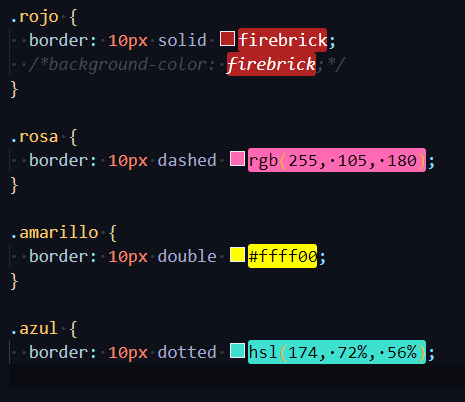

# CURSO CSS UNI

- [CURSO CSS UNI](#curso-css-uni)
  - [Tipos de CSS](#tipos-de-css)
  - [Selector ID (#)](#selector-id-)
  - [Clases (.)](#clases-)
  - [Selector Universal (\*)](#selector-universal-)
  - [Agrupar Elementos HTML y CSS](#agrupar-elementos-html-y-css)
  - [Sunclases en CSS](#sunclases-en-css)
  - [COLORES](#colores)
  - [Colores y Bordes](#colores-y-bordes)
  - [Comentarios](#comentarios)
  - [Manejo de Bordes](#manejo-de-bordes)

## Tipos de CSS

- Inline CSS

``` css
<h1 style="color: blue; text-align: center; font-size: 100px">Universidad CSS</h1>
```

- Internal CSS

``` css
<style>
h1{
  color:red;
  text-align: right;
  }
</style>
```

- External CSS
  - Esta es la mejor practica

> Podemos usar las teclas Ctrl + Space para selecionar las carpeta del css y despues seleccionar el archivo css

```
<link rel="stylesheet" href="css/estilos.css">
```

## Selector ID (#)

> Este tipo de selector lo usaremos para modificar un elemento html que <span style="color:red">**es unico**</span> dentro de nuestra pagina y no se repite, como por ejemplo el **H1**

```
<h1 id="titulo">Universidad CSS</h1>
```

## Clases (.)

> No usar numeros al inicio y si son dos palabras separar con \_ o -. Eso lo usaremos para <span style="color:red">**reutilizar**</span> en otros elementos de html

> Para agregar otra clase al mismo elemento so hay que dejar un espacio e insrtar el nobre de la segunda clase.

```
<p class="centrar texto_grande">Iniciando el curso de CSS</p>
<p class="centrar">www.globalmentoring.com.mx</p>
```

## Selector Universal (\*)

> Este tipo de selector se aplica a toda nuestra pagina HTML. Como buena practica lo posicionaremos al inicio de nuestro documento css.

``` css
*{
  background-color: ghostwhite;
  color: cornflowerblue;
 }
```

## Agrupar Elementos HTML y CSS

> Esto para aplicar los mismos estilos a varios elementos html o tambien clases o selctores. Los podemos convinar o agrupar.

``` css
h1, h2, p, div{
  color: crimson;
  text-align: center;
}
```

## Sunclases en CSS

> Utilizamos una clase que se aplicara a los elementos de html que sean del mismo tipo que seleccionamos (etiqueta p).

``` css
p.centrar{
  text-align: center;
}
```

``` html
<p class="centrar">Iniciando el curso de CSS</p>
<p class="centrar">www.globalmentoring.com.mx</p>
```

## COLORES

> RGB
> > R = Red(Rojo)  
> > G = Green(Verde)
> > B = Blue(Azul)


> hsl
> > h = hue(color, matiz)  
> > s = saturation(saturacion)
> > l = lightness(iluminacion)

> Los navegadores modernos soportan 140 colores con nombre. Los podemos usar en el código HTML y CSS por nombre, código Hex o el valor RGB.
> [Pagina de los colores](https://htmlcolorcodes.com/es/nombres-de-los-colores/)

## Colores y Bordes

Border se refiere al contorno, y los 10px al ancho de la line del contorno, solid al tipo de contorno y por ultimo el color del la linea del border.


``` css
.rojo {
  border: 10px solid firebrick;
}
```




## Comentarios

``` css
/*background-color: black;*/
```

## Manejo de Bordes

