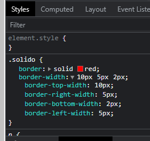
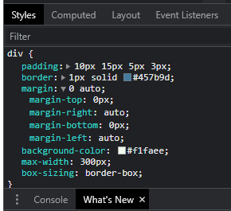

<H1>CURSO CSS UNI</H1>

- [**_Introduccion_**](#introduccion)
  - [Tipos de CSS](#tipos-de-css)
  - [Selector ID (#)](#selector-id-)
  - [Clases (.)](#clases-)
  - [Selector Universal (\*)](#selector-universal-)
  - [Agrupar Elementos HTML y CSS](#agrupar-elementos-html-y-css)
  - [Sunclases en CSS](#sunclases-en-css)
- [**_COLORES, BORDES Y MAS_**](#colores-bordes-y-mas)
  - [Colores por nombre](#colores-por-nombre)
  - [Colores y Bordes](#colores-y-bordes)
  - [Comentarios](#comentarios)
  - [Manejo de Bordes](#manejo-de-bordes)
  - [Ancho de Bordes](#ancho-de-bordes)
    - [Como aplicar una medida distinta en cada lado?](#como-aplicar-una-medida-distinta-en-cada-lado)
- [**_Codigo de Colores en Bordes_**](#codigo-de-colores-en-bordes)
    - [Como aplicar un color distinto en cada lado?](#como-aplicar-un-color-distinto-en-cada-lado)
  - [Redondeo de bordes](#redondeo-de-bordes)
- [**_BOX MODEL_**](#box-model)
  - [Ancho del Elemento Box Model](#ancho-del-elemento-box-model)
  - [Outline](#outline)
  - [Outline-Offset](#outline-offset)
  - [**_PADDING_**](#padding)
  - [Box Sizing](#box-sizing)
  - [Propiedad Max-Width](#propiedad-max-width)
  - [Propiedad Margin: Auto](#propiedad-margin-auto)
  - [Propiedad ***inherit***](#propiedad-inherit)
  - [Concepto de margin collapse](#concepto-de-margin-collapse)
- [***Manejo de colores***](#manejo-de-colores)
  - [Color por nombre HTML](#color-por-nombre-html)
  - [Manejo de colores **RGB**](#manejo-de-colores-rgb)
  - [Codigo de colores **Hexadecimal**](#codigo-de-colores-hexadecimal)
  - [Codigo de colores **HSL**](#codigo-de-colores-hsl)
- [***Manejo de fondos***](#manejo-de-fondos)

## **_Introduccion_**

### Tipos de CSS

- Inline CSS

```css
<h1 style="color: blue; text-align: center; font-size: 100px">Universidad CSS</h1>
```

- Internal CSS

```css
<style>
h1{
  color:red;
  text-align: right;
  }
</style>
```

- External CSS
  - Esta es la mejor practica

> Podemos usar las teclas Ctrl + Space para selecionar las carpeta del css y despues seleccionar el archivo css

```
<link rel="stylesheet" href="css/estilos.css">
```

### Selector ID (#)

> Este tipo de selector lo usaremos para modificar un elemento html que <span style="color:red">**es unico**</span> dentro de nuestra pagina y no se repite, como por ejemplo el **H1**

```
<h1 id="titulo">Universidad CSS</h1>
```

### Clases (.)

> No usar numeros al inicio y si son dos palabras separar con \_ o -. Eso lo usaremos para <span style="color:red">**reutilizar**</span> en otros elementos de html

> Para agregar otra clase al mismo elemento so hay que dejar un espacio e insrtar el nobre de la segunda clase.

```
<p class="centrar texto_grande">Iniciando el curso de CSS</p>
<p class="centrar">www.globalmentoring.com.mx</p>
```

### Selector Universal (\*)

> Este tipo de selector se aplica a toda nuestra pagina HTML. Como buena practica lo posicionaremos al inicio de nuestro documento css.

```css
* {
  background-color: ghostwhite;
  color: cornflowerblue;
}
```

### Agrupar Elementos HTML y CSS

> Esto para aplicar los mismos estilos a varios elementos html o tambien clases o selctores. Los podemos convinar o agrupar.

```css
h1,
h2,
p,
div {
  color: crimson;
  text-align: center;
}
```

### Sunclases en CSS

> Utilizamos una clase que se aplicara a los elementos de html que sean del mismo tipo que seleccionamos (etiqueta p).

```css
p.centrar {
  text-align: center;
}
```

```html
<p class="centrar">Iniciando el curso de CSS</p>
<p class="centrar">www.globalmentoring.com.mx</p>
```

## **_COLORES, BORDES Y MAS_**

### Colores por nombre

[Pagina de Colores](https://htmlcolorcodes.com/color-names/ "enlase")

> RGB
>
> > R = Red(Rojo)  
> > G = Green(Verde)
> > B = Blue(Azul)

> hsl
>
> > h = hue(color, matiz)  
> > s = saturation(saturacion)
> > l = lightness(iluminacion)

> Los navegadores modernos soportan 140 colores con nombre. Los podemos usar en el código HTML y CSS por nombre, código Hex o el valor RGB.
> [Pagina de los colores](https://htmlcolorcodes.com/es/nombres-de-los-colores/)

### Colores y Bordes

Border se refiere al contorno, y los 10px al ancho de la line del contorno, solid al tipo de contorno y por ultimo el color del la linea del border.

```css
.rojo {
  border: 10px solid firebrick;
}
```


### Comentarios

```css
/*background-color: black;*/
```

### Manejo de Bordes

De esta forma solo modificamos el tipo de borde

```css
.discontinuo {
  border-style: dashed;
}
```

De esta forma solo modificamos el tipo y el grosor dl border

```css
.doble {
  border: 5px double;
}
```

Forma simplificada

```css
.solido {
  border: 10px solid red;
}
```

Forma completa

```css
.surco {
  border-width: 10px;
  border-style: groove;
}
```

De esta forma podemos modificar todos los lados del borde

```css
.mixto {
  border-style: dotted solid dashed double;
}
```

### Ancho de Bordes

#### Como aplicar una medida distinta en cada lado?

```css
.punteado {
  border-style: dotted;
  border-width: 10px 5px 3px 2px;
}
```

Para poder visualizar los hanchos de los bordes podemos usar la consola y desplegar que medidas se estan aplicando.



## **_Codigo de Colores en Bordes_**

#### Como aplicar un color distinto en cada lado?

```css
.punteado {
  border-style: dotted;
  border-width: 10px 5px 3px 2px;
  border-color: crimson hotpink gold lime;
}
```

- Un valor de 1 en la transparencia = color completo.
- Un valor de 0 en la transparencia = complatamente transparente.
- Un valor de .5 en la transparencia = 50% de transparencia.

```css
.discontinuo {
  border-style: dashed;
  border-width: thick;
  /*thin, medium, thick*/
  border-color: hsla(203, 39%, 44%, 1);
  border-color: hsla(203, 39%, 44%, 0);
  border-color: hsla(203, 39%, 44%, 0.5);
}
```

### Redondeo de bordes

> Podemos crear links que parescan botones, pero mas estilizados.

```css
.solido {
  border: solid red;
  border-width: 5px;
  border-radius: 20px;
}
```

- En el border-radius **20px** es la esquina superior izquierda.
- En el border-radius **0px** es la esquina superior derecha.
- En el border-radius **10px** es la esquina inferior derecha.
- En el border-radius **0px** es la esquina inferior izquierda.

```css
.redondeado {
  border: 5px solid blueviolet;
  border-radius: 20px 0px 10px 0px;
}
```

## **_BOX MODEL_**

El padding y el Margin son transparentes y el border puede tner color.


### Ancho del Elemento Box Model

Debemos tener en cuenta las medidas del contenido + el padding + border + margin

### Outline

Este se encuentra entre el margin y el border,
le podemos dar color y estilo de border. Se puede sobreponer a otros elementos.

```css
outline: 10px outset #a8dadc;
```

### Outline-Offset

Este se inserta entre el border y el Outline, solo se le puede aplicar un solo valor. No se le puede aplicar color.

### **_PADDING_**

Se encuentra entre el border y el contenido.


### Box Sizing

CSS utiliza el box-content, pero no incluye el width ni el padding ni border.

> Si no queremos pasarnos de la medida qu le indicamos al width debemos utilizar `box-sizing: border-box`


### Propiedad Max-Width 

Esta propidad la ocuparemos para que no aparesca la barra de escrol y para indicar hasta donde puede maximo ajustarse. Tambien lo podemos usa en el max-height.
se pueden usar en pixeles o en porsentaje.

`max-width: 100%;`

`max-width: 300px;`

`max-height:100px;`

### Propiedad Margin: Auto

Lo utilizaremos para centrar un elmento.
Con `margin: auto` va atomar automaticamente un por partes iguales el lado izquierdo como el lado derecho quedando asi centrado.

La propiedad de ` 0 auto;` el cero va atomar la parte superior (top) e infrior (bottom) y l auto el lado derecho (right) e izquierdo (left), siempre y cuando sean elementos inline.

`margin: 0 auto;`




### Propiedad ***inherit***


Donde colocamos el inhrit va heredar la propiedad del elemento padre,  no olvidar colocar una clase. sin inherit se tomara su valor por default.


``` css
div {
    padding: 10px 15px 5px 3px;
    border: 1px solid #457b9d;
    margin-left: 100px;
    background-color: #f1faee;
    max-width: 300px;
    box-sizing: border-box;
}

p.interno {
    margin-left: inherit;
}
```

### Concepto de margin collapse

Esto ocurre cuando tenemos dos cajas, y se aplica en los margenes inferior y superior.

El margen se junta con el margn del elemnto inferior, omando un solo margen para los dos,
si el margen del elemento supeior es mayor ese es el que se toma. ***Los margenes no se suman***


## ***Manejo de colores***

### Color por nombre HTML

[Pagina de Colores por nombre](https://htmlcolorcodes.com/color-names/)

### Manejo de colores **RGB** 


El rgb tambien maneja el concepto de transparencia, se le conoce como alpha, es significa que se va intigrar con el color de fondo.

Si ponemos el valor de **1** no tenemos transparencia y si ponemos **0** tenemos la mayor transparencia, y para tener el 50% de transparencia usamos el **.5**


- r = Red `rgb(255,0,0)`
- g = Green `rgb(0,255,0)`
- b = Blue `rgb(0,0,255)`
- a = Alpha `rgb(255,0,0,.5)`

``` css
.rgb{
    background-color: rgb(131,56,236);
}
.rgba{
    background-color: rgba(131, 56, 236, .5);
}
```

### Codigo de colores **Hexadecimal**

- Se compone de 6 digitos. 
- Se inicia con #.
- Tambien podemos usar transparencia agregando 2 digitos mas 
  - `#0090adff` no hay transparencia
  - `#0090ad00` maxima transparencia
  - `#0090ad88` 50% de transparencia
- El primer par corresponde al color rojo `#ff0000` seundo par es verde `#00ff00` y el tercer par es azul `#0000ff.
- Pa simplificar por pares podemos usar solo un numero o letra `#fa2` = `#ffaa22`

### Codigo de colores **HSL**

El hsl tambien maneja el concepto de transparencia, se le conoce como alpha, es significa que se va intigrar con el color de fondo.

Si ponemos el valor de **1** no tenemos transparencia y si ponemos **0** tenemos la mayor transparencia, y para tener el 50% de transparencia usamos el **.5**


- h = Hue `hsl(195, 100%, 50%)`  el 195 se toma de una rueda de colores.
- s = Saturation `hsl(85, 100%, 50%)` es un porsentaje que va del 0% al 100%
- l = Lightnees `hsl(20, 50%, 100%)`  la iluminacion es un porsentaje que va del 0% al 100%
- a = Alpha `hsl(195,100%,50%,.5)`


## ***Manejo de fondos***

